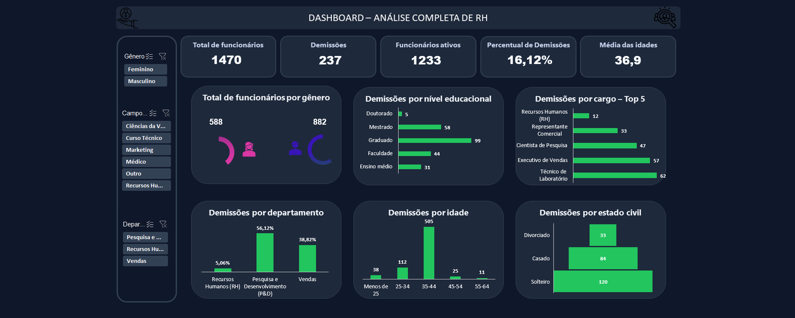

# 📊 Painel de análise de demissões/desligamento - Dashboard (Excel)

## 📌 Introdução

Neste projeto, simulei um cenário:

O gestor da área solicitou uma análise para entender melhor os padrões de **demissões na empresa** e identificar possíveis fatores associados ao turnover.

Utilizando um dataset público de RH do Kaggle, desenvolvi uma análise exploratória e um dashboard interativo no Excel com o objetivo de responder perguntas como:

- Quais áreas apresentam maior número de demissões?
- Existe algum padrão de idade ou perfil entre os funcionários que saem da empresa?
- Quais cargos possuem maior rotatividade?
- Existe relação com nível educacional ou estado civil?

## 🛠 Ferramentas utilizadas

- Microsoft Excel
- Tabelas Dinâmicas
- Gráficos Dinâmicos
- Segmentações de dados

---

## 📊 Métricas principais analisadas

O dashboard apresenta indicadores-chave para análise de turnover:

- Total de Funcionários: **1470**
- Total de Demissões: **237**
- Funcionários Ativos: **1233**
- Taxa de Demissão: **16,12%**
- Média de Idade dos funcionários da empresa: **36,9 anos**

---

## 🔎 Principais análises realizadas

A análise foi estruturada considerando diferentes dimensões do dataset:

- Demissões por **cargo**
- Demissões por **departamento**
- Demissões por **faixa etária**
- Demissões por **estado civil**
- Demissões por **nível educacional**
- Distribuição de funcionários por **gênero**

O dashboard também inclui filtros interativos para explorar os dados por:

- Gênero
- Campo educacional
- Departamento

---

## 📈 Principais insights

### 1️⃣ Concentração de demissões no departamento de Pesquisa & Desenvolvimento

O departamento de **Pesquisa e Desenvolvimento (P&D)** apresenta a maior proporção de demissões, representando aproximadamente **56%** do total.

Isso pode indicar fatores como:

- maior pressão por resultados
- mercado competitivo para profissionais técnicos
- oportunidades externas mais atrativas

---

### 2️⃣ Cargo com maior rotatividade

O cargo de **Técnico de Laboratório** apresenta o maior número de demissões entre os cargos analisados.

Possíveis fatores associados:

- natureza operacional da função
- oportunidades de crescimento limitadas
- maior rotatividade típica desse tipo de posição

---

### 3️⃣ Faixa etária com maior número de desligamentos

A faixa etária **35–44 anos** apresenta o maior volume de demissões.

Isso pode indicar:

- profissionais experientes buscando novas oportunidades
- transições de carreira nesse estágio profissional

---

### 4️⃣ Demissões por Estado Civil

Funcionários **solteiros** apresentam o maior número de demissões.

Isso pode estar relacionado a:

- maior mobilidade no mercado de trabalho
- menor preocupação com contas a pagar ou sustento de uma família

---

### 5️⃣ Nível educacional

A maior concentração de demissões ocorre entre funcionários com **graduação completa**.

 - Seria interessante fazer uma análise mais profunda do problema, já que funcionários que possuem mestrado também tem uma alta taxa de desligamento da empresa
 - Isso pode sugerir maior mobilidade de profissionais qualificados no mercado.
 - O fato de funcionários apenas com o ensino médio terem um menor número de demissões,pode indicar que nos cargos que exigem uma graduação, a exigência técnica é muito maior

---

## ✔️ Conclusão

A análise sugere que a rotatividade na empresa está concentrada principalmente em:

- Idade, em que tanto no gênero masculino e feminino a faixa com o maor número de demissões está entre 35 e 44 anos.
- Áreas técnicas, departamento de pesquisa e desenvolvimento possui o maior percentual de demissões. Os cargos desse departamento são técnico de laboratório e Cientista de Pesquisa, ambos possuindo alto número de demissões.
-  Profissionais em estágios intermediários da carreira

Esses insights podem ajudar a organização a desenvolver estratégias voltadas para:

- Retenção de talentos, oferecendo condições melhores e apoio principalmente as áreas com alto número de demissão.
- Melhoria de planos de carreira, trazendo uma alta atratividade para pessoas recém graduadas e até com mestrado.
- Avaliação de fatores relacionados à satisfação no trabalho

---

## 📎 Dataset

Dataset utilizado:

HR-Employee-Attrition – Kaggle

📥 [Clique aqui para baixar o dashboard e o dataset analisado](data/dashboard_rh.xlsx)

**O dataset e o dashboard estão no mesmo arquivo**

## 🚀 Possíveis evoluções do projeto

Algumas análises adicionais que poderiam expandir este estudo:

- Impacto de satisfação do trabalho no turnover
- Análise de demissões x viagens a trabalho, buscando entender se quem viaja mais a trabalho possui mais demissões.
- Dashboard em Power Bi considerando todas as variáveis utilizadas e outras métricas comerciais. Uso de tooltips,visuais e filtros para melhor entendimento da análise.
